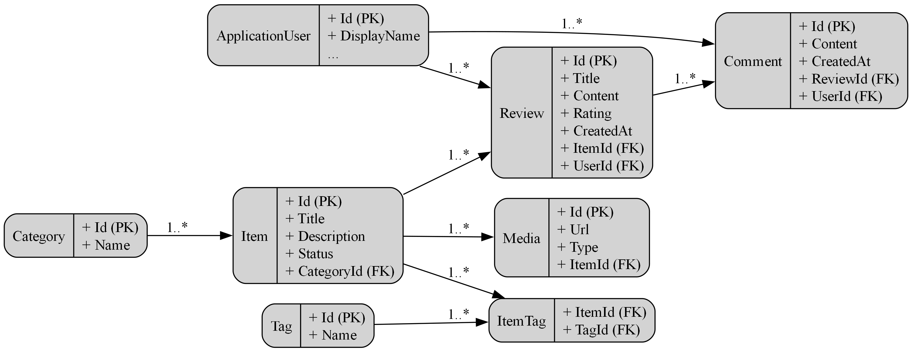

# Where To Spend Your Time

**Live Demo:** [where-to-spend-your-time.onrender.com](https://where-to-spend-your-time.onrender.com)

This project is a **full-stack web application** where users can discover, review, and discuss various time spending activities such as books, movies, games and so on. It was built with the intention of practicing clean architecture, full-stack development, and role-based authorization.

**Note:** The project is still under development. All core features are implemented and functional, but there may be issues with validation and unexpected errors that are currently being addressed.

---

## Features

* **Role-based access control**

  * **Guest (unauthorized):** Can browse items, reviews, comments, see statistics, view profiles, filter/sort/search — but cannot interact.
  * **User:** Can post/edit/delete their reviews and comments, and manage their own profile.
  * **Moderator:** Can delete inappropriate reviews and comments from other users.
  * **Admin:** Full control - manage categories, tags, items, roles, and users.
* **User authentication & profiles** (register, login, update display name, change password)
* **Item management** with categories, tags, reviews, media
* **Interactive UI** with filtering, sorting, and searching
* **Two visual themes:** Solid (dark gradient) & Aurora (animated gradient)
* **Media storage** using Azure Blob Storage

---

## Tech Stack

### **Backend**

* **C# / .NET** - API project
* **Entity Framework Core** - database migrations & data access
* **Architecture:**

  * Data Layer (DbContext + EF Core)
  * Service Layer (business logic)
  * Controller Layer (API endpoints for frontend)

### **Frontend**

* **React + TypeScript + Vite + TailwindCSS**
* Key libraries:

  * `axios` - API calls
  * `react-router-dom` - routing
  * `lucide-react` - icons
  * `react-select` - advanced dropdowns

### **Database**
* **PostgreSQL** - relational database
* **EF Core migrations** used for schema management
* Entities: Users, Items, Categories, Reviews, Comments, Tags, Media

### **Deployment**

* **Backend, Frontend, Database:** Deployed on [Render](https://render.com)
* **Media Storage:** Azure Storage Account

---

## Database Schema (ERD)

The database schema is built using **EF Core migrations** based on entity classes.

---

## Project goals

This project demonstrates:

* Full-stack application design
* Clean separation of backend layers
* Frontend development with modern stack (React + TS + Vite + Tailwind)
* Role-based security and authorization
* Cloud deployment experience (Render + Azure)

It is intended both as a **portfolio project** and as a practical playground for experimenting with modern web development practices.

---

## Links

* **Live App:** [where-to-spend-your-time.onrender.com](https://where-to-spend-your-time.onrender.com)
* **Database Schema:** see ERD diagram above
