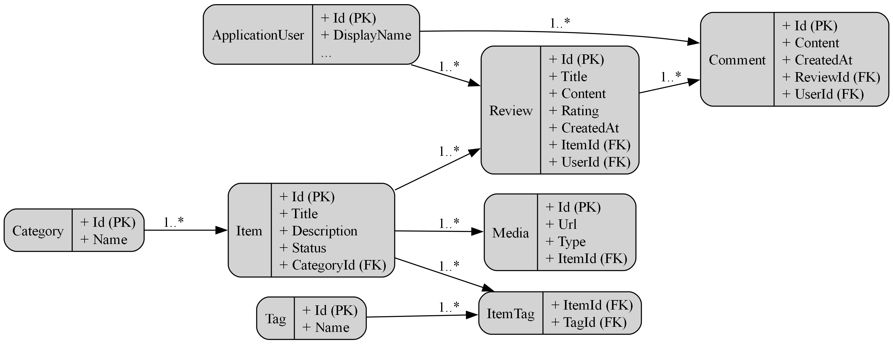

# Where To Spend Your Time

> **Note about performance:** Due to low-level deployment subscription, Render servers spin down after inactivity. The first request after inactivity may be delayed by up to 50 seconds while the server spins up. So, **_~1 minute needed for the app in the link to start working._**

**Live Demo:** [where-to-spend-your-time.onrender.com](https://where-to-spend-your-time.onrender.com)

This project is a **full-stack web application** where users can discover, review, and discuss various time spending activities such as books, movies, games and so on. It was built with the intention of practicing clean architecture, full-stack development, and role-based authorization.

> **Note:** This project is still in development. All core features are working, but there may be some validation issues and unexpected errors that are in the process of being fixed.

---

## Features

* **Role-based access control**

  * **Guest (unauthorized):** Can browse items, reviews, comments, see statistics, view profiles, filter/sort/search - but cannot interact.
  * **User:** Can post/edit/delete their reviews and comments, and manage their own profile.
  * **Moderator:** Can delete inappropriate reviews and comments from other users.
  * **Admin:** Full control - manage categories, tags, items, roles, and users.
* **User authentication & profiles** (register, login, update display name, change password)
* **Item management** with categories, tags, reviews, media
* **Interactive UI** with filtering, sorting, and searching
* **Two visual themes:** Solid (dark gradient) & Aurora (animated gradient)
* **Media storage** using Azure Blob Storage

---

## Project Structure

* Frontend/ # React frontend (Vite + TypeScript)
* WhereToSpendYourTime.Api/ # ASP.NET Core Web API (entry point)
* WhereToSpendYourTime.Data/ # Data layer (EF Core, DbContext, Entities)
* WhereToSpendYourTime.ShareLib/ # Shared models
* WhereToSpendYourTime.Tests/ # Unit tests
* WhereToSpendYourTime.sln # Solution file
* Dockerfile # Docker configuration for backend

---

## Tech Stack

### **Backend**

* **C# / .NET** - API project
* **Entity Framework Core** - database migrations & data access
* **Architecture:**

  * Data Layer (DbContext + EF Core)
  * Service Layer (business logic)
  * Controller Layer (API endpoints for frontend)

### **Frontend**

* **React + TypeScript + Vite + TailwindCSS**
* Key libraries:

  * `axios` - API calls
  * `react-router-dom` - routing
  * `lucide-react` - icons
  * `react-select` - advanced dropdowns

### **Database**
* **PostgreSQL** - relational database
* **EF Core migrations** used for schema management
* Entities: Users, Items, Categories, Reviews, Comments, Tags, Media

### **Deployment**

* **Backend, Frontend, Database:** Deployed on [Render](https://render.com)
* **Media Storage:** Azure Storage Account

### **Demo Account**
To make it easier to test the platform, you can log in using this demo account:
```text
Login: demo@example.com
Password: Demoaccount333!
```
This account has the **User** role and already contains some reviews and comments, which allows you to test managing comments and reviews without previous registration and data set up.

---

## Database Schema (ERD)



The database schema is built using **EF Core migrations** based on entity classes.

---

## Project goals

This project demonstrates:

* Full-stack application design
* Clean separation of backend layers
* Frontend development with modern stack (React + TS + Vite + Tailwind)
* Role-based security and authorization
* Cloud deployment experience (Render + Azure)

It is intended both as a **portfolio project** and as a practical playground for experimenting with modern web development practices.

---

## Local Development Setup

### Prerequisites

* .NET SDK (version 9.0)
* Node.js (v18+ recommended)
* PostgreSQL
* (Optional) Azure Storage account or emulator

---

### 1. Clone the repository

* git clone <your-repo-url>
* cd where-to-spend-your-time

---

### 2. Backend Setup

Navigate to API project:

cd WhereToSpendYourTime.Api

Update configuration in appsettings.Development.json:

* PostgreSQL connection string
* Azure Blob Storage settings

Apply migrations:

dotnet ef database update

Run backend:

dotnet run

Backend will run at:

https://localhost:7005

---

### 3. Frontend Setup

cd Frontend

Create .env.local:

VITE_API_URL=https://localhost:7005

Install dependencies:

npm install

Run frontend:

npm run dev

Frontend runs at:

http://localhost:5173

---

### 4. Notes

* Make sure backend is running before using frontend
* Authentication uses cookies, so both apps must run on compatible origins

---

### Running with Docker (Backend)

You can run the backend using Docker.

Build image

docker build -t where-to-spend-your-time-api .

Run container

docker run -p 10000:10000 where-to-spend-your-time-api

The API will be available at:

http://localhost:10000

---

## Links

* **Live App:** [where-to-spend-your-time.onrender.com](https://where-to-spend-your-time.onrender.com)
* **Database Schema:** see ERD diagram above
